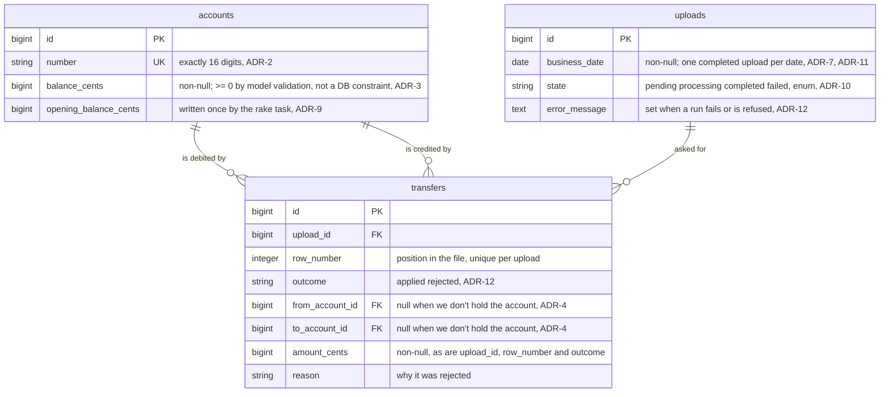

# Transfer Uploader

A small banking service. It loads a company's account balances, then applies a day's
transfers between those accounts from a CSV file.

## The problem

Each day a company sends a CSV file of transfers they want made between accounts.
The system loads their starting balances, accepts the day's transfers, applies the
valid ones, and reports what happened: what was applied, what was rejected and why,
and where the balances ended up.

### What the brief requires

- An account is identified by a 16 digit number.
- Money can't leave an account if that would put the balance below $0.
- Load one company's balances, then accept a day's transfers from a CSV file.

### What was decided

- Amounts are integer cents, validated to two decimal places, so there's no float
  drift and no rounding
  ([ADR-1](docs/adr/0001-represent-money-as-integer-cents.md)).
- Transfers apply in file order, each seeing the balances left by the ones before it,
  so a rejection can be explained by position
  ([ADR-4](docs/adr/0004-apply-transfers-sequentially-with-per-transfer-rejection.md)).
- A transfer refused by a rule is recorded as rejected, and the rest of the file
  still applies (ADR-4).
- A line we can't parse - a bad amount, a 15 digit account number, a transfer from an
  account to itself - fails the whole upload. The date stays open, so the company
  fixes the file and sends it again
  ([ADR-6](docs/adr/0006-parse-csv-at-an-explicit-boundary-layer.md)).
- A business date accepts one file. Re-submitting a date that has already been
  processed is an error, so a day's transfers can't be applied twice
  ([ADR-11](docs/adr/0011-make-transfers-uploads-idempotent.md)).
- The file arrives over HTTP with its business date beside it, and a background job
  applies it
  ([ADR-7](docs/adr/0007-accept-transfers-uploads-over-http.md),
  [ADR-10](docs/adr/0010-process-uploads-in-a-background-job.md)).

### What we left out

No login, sessions or authorisation
([ADR-8](docs/adr/0008-one-company-no-login-no-scoping.md)). No multi-company
scoping. No ledger, so no balances as of a date and no reversals - a mistake is
corrected by another transfer
([ADR-3](docs/adr/0003-persist-accounts-with-a-mutable-balance-column.md)). No
restarting a day once it has been processed (ADR-11).

### Processing

Uploads aren't processed in the request. We store the file, create an upload record,
and a background job applies it while the upload's status page shows the run's state
and then the report. Only one run happens at a time, so a rejection can always be
explained from the file that caused it. Every line of a completed upload has its
outcome stored, and a failed run keeps its error, so either can be read back days
later ([ADR-10](docs/adr/0010-process-uploads-in-a-background-job.md),
[ADR-12](docs/adr/0012-record-every-line-outcome-on-transfers.md)).

A run is a single transaction, so an upload either applied or it didn't. That rests on
one assumption: a day's file is thousands of rows, and the upload page caps it at
8 MB to keep it that way. If files grow, it's the first thing to revisit
([ADR-4](docs/adr/0004-apply-transfers-sequentially-with-per-transfer-rejection.md),
[ADR-7](docs/adr/0007-accept-transfers-uploads-over-http.md)).

### Input formats

Both files are headerless CSV. Samples are in [`samples/`](samples/).

Account balances, as `account_number,balance`:

```csv
1111234522226789,5000.00
1111234522221234,10000.00
2222123433331212,550.00
1212343433335665,1200.00
3212343433335755,50000.00
```

Transfers, as `from_account,to_account,amount`:

```csv
1111234522226789,1212343433335665,500.00
3212343433335755,2222123433331212,1000.00
3212343433335755,1111234522226789,320.50
1111234522221234,1212343433335665,25.60
```

The transfers upload also takes the business date the file covers, supplied
alongside the file rather than inside it
([ADR-7](docs/adr/0007-accept-transfers-uploads-over-http.md)).

## Getting started

You need Ruby (see [`.ruby-version`](.ruby-version)) and Docker for the local
PostgreSQL database. PostgreSQL runs in every environment, including test.

```sh
docker compose up -d       # PostgreSQL
bin/setup --skip-server    # gems and database, without starting the server
```

Then load the opening balances, and start the app:

```sh
bin/rails "balances:load[./samples/account_balances.csv]"
bin/dev
```

Load the balances before uploading any transfers. A transfer naming an account we
don't hold is rejected rather than applied, so a file uploaded against an empty
database comes back with every row rejected as an unknown account.

`bin/setup` on its own does the same setup and then starts the server.

### Running the app

```sh
bin/dev
```

Serves on <http://localhost:3000> and starts the job worker that processes uploads.
There's a health endpoint at `/up`.

Opening balances are loaded once, from the command line rather than the web app
([ADR-9](docs/adr/0009-load-opening-balances-with-a-rake-task.md)):

```sh
bin/rails "balances:load[./samples/account_balances.csv]"
```

It only ever creates accounts. Re-running with a file that has grown adds the new
accounts and leaves every existing balance alone, so a balance that has moved can
still only be changed by a transfer.

### Tests, lint and scans

```sh
bundle exec rspec
bin/rubocop          # style
bin/brakeman         # Rails security static analysis
bin/bundler-audit    # known CVEs in gems
```

CI runs all of these on every push and pull request. See
[`.github/workflows/ci.yml`](.github/workflows/ci.yml).

## Architecture

Decisions are recorded as ADRs in [`docs/adr/`](docs/adr/). The
[index](docs/adr/README.md) is the place to start.

No application code exists yet. The diagram below is the model the ADRs
describe, not a map of what's in `app/`.

Note: the UI/Views was done with the help of AI to get it going quick

### The model

Three tables. `accounts` is loaded once by a rake task (ADR-9) and outlives
everything; the other two are the record of what each day's file asked for and
what we did about it.


